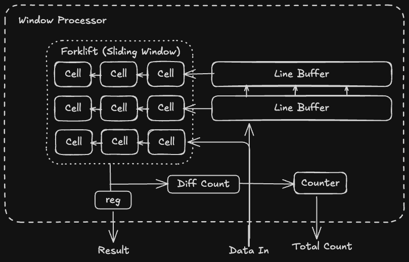

# Advent of FPGA 2025

## Topic Draft

### Overview

- I solve only problem 4 (both part 1 and 2), basically a subvariant of Convey's Game of Life
- My goal is leverage Hardcaml's abstraction to make a type-safe, highly-configurable solution
  that support a grid with more than 100k rows with the Kria board.

### Architecture

<p align="center">
  
</p>

- diagram 1 : overview
- diagram 2 : sliding window + vectorization
- diagram 3 : processor and its line buffer
- diagram 4 : solver (brief)

### Optimization Technique Involved

- sideband metadata
- store only what needed
- circuit tree reduction (e.g. popcount and tree ~arity:2)
- vectorization

### Software Engineering

- circuit-metadata safety & dep injection
- use only add in the circuit, avoiding subtle underflow bug caused by subtraction

```
    let total_ram_count = Sw.kernel_row_size - 1 in <-- This is ok since it's circuit generation.
    let rptr =
        mux2
        (reading_col_idx <: col_size -:. 1) <-- But this is not OK, prone to integer underflowing!
        (reading_col_idx +:. 1)
        (zero Cfg.input_col_bit_width)
    in
    let no_underflow_rptr =
        mux2
        (reading_col_idx +:. 1 <: col_size) <-- Do this instead.
        (reading_col_idx +:. 1)
        (zero Cfg.input_col_bit_width)
    in
```

- minimal state

### Performance and Resource Utilization Analysis

- TODO

### Note

- For solver, code quality is degraded since it's intended to use only for simulation.
- You can find designed draft on paper in /xxx TODO: add picture of my design on paper

### Future Improvements

- "monoid circuit" for creating type-safe superpipeline
- testbench need some refactoring
- the unfinished TODO tasks in the codebase
- heirarchical design (must be done before generating RTL code)
- complex behavioral test e.g. enable pin
